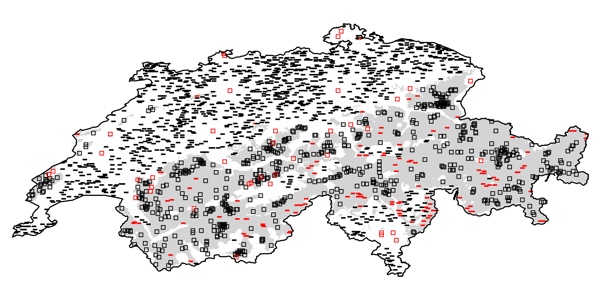
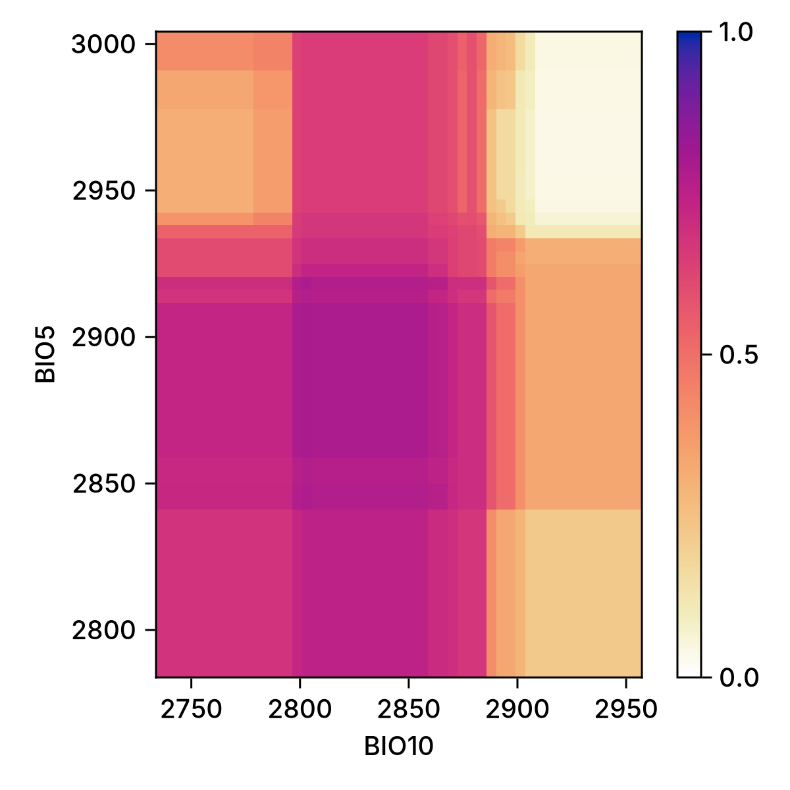
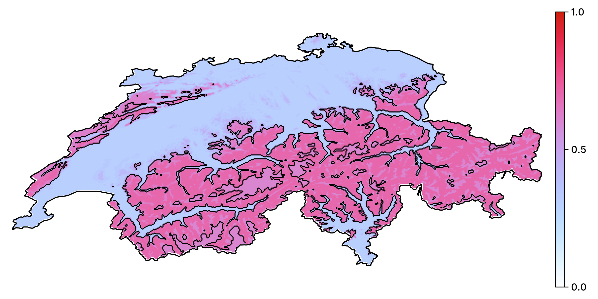
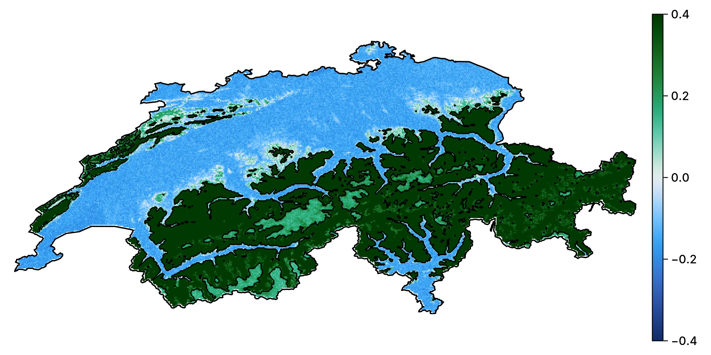
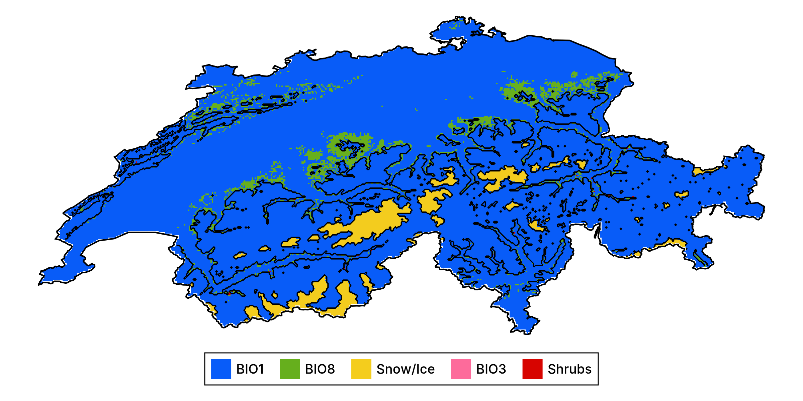

## Main goals

1. How do we produce a model?
2. How do we convey that it works?
3. How do we talk about how it makes predictions?
4. How do we use it to guide actions?

## But why...

... think of SDM as ML problems?
: Because they are! We want to learn a predictive algorithm from data

... the focus on explainability?
: We cannot ask people to *trust* - we must *convince* and *explain*

## What we will *not* discuss

1. Image recognition
2. Sound recognition
3. Generative AI

## Learning/teaching goals

- ML basics
    - cross-validation
    - hyper-parameters tuning
    - bagging and ensembles
- Pitfalls
    - data leakage
    - overfitting
- Explainable ML
    - partial responses
    - Shapley values
- Counterfactuals

# Problem statement

## The problem in ecological terms

We have information about a species, taking the form of $(\text{lon}, \text{lat})$ for
points where the species was observed

Using this information, we can extract a suite of environmental variables for the locations
where the species was observed

We can do the same thing for locations where the species was not observed

\alert{Where could we observe this species}?

## The problem in ML terms

We have a series of labels $\mathbf{y}_n \in \mathbb{B}$, and features
$\mathbf{X}_{m,n} \in \mathbb{R}$

We want to find an algorithm $f(\mathbf{x}_m) = \hat y$ that results in the
distance between $\hat y$ and $y$ being *small*

An algorithm that does this job well is generalizable (we can apply it on data it has not
been trained on) and makes credible predictions

## Setting up the data for our example

We will use data on observations of *Turdus torquatus* in Switzerland,
downloaded from the copy of the eBird dataset on GBIF

Two series of environmental layers

1. CHELSA2 BioClim variables (19)
2. EarthEnv land cover variables (12)

Now is *not* the time to make assumptions about which are relevant!

## The observation data

\ 

## Problem (and solution)

We want $\textbf{y} \in \mathbb{B}$, and so far we are missing \alert{negative
values}

We generate \alert{pseudo}-absences with the following rules:

1. Locations further away from a presence are more likely
2. Locations less than 5km away from a presence are ruled out

## The (inflated) observation data

\ 

# Training the model

## A simple decision tree

## Setup

## Cross-validation

Can we train the model?

More specifically -- if we train the model, how well can we expect it to perform?

assumes parallel universes with slightly less data

is the model good?

## Null classifiers

coin flip

no skill

constant

## Expectations

The null classifiers tell us what we need to beat in order to perform \alert{better than
random}.

| **Model** | **MCC** | **PPV** | **NPV** | **DOR** | **Accuracy** |
|----------:|--------:|--------:|--------:|--------:|-------------:|
| No skill  | -0.00   |  0.34   |  0.66   |  1.00   |  0.55        |
| Coin flip | -0.32   |  0.34   |  0.34   |  0.26   |  0.34        |
| +         |  0.00   |  0.34   |         |         |  0.34        |
| -         |  0.00   |         |  0.66   |         |  0.66        |

In practice, the no-skill classifier is the most informative: what if we \alert{only} know
the positive class prevalence?

## Cross-validation strategy

k-fold

validation / training / testing

## Cross-validation results

| **Model**        | **MCC** | **PPV** | **NPV** | **DOR** | **Accuracy** |
|-----------------:|--------:|--------:|--------:|--------:|-------------:|
| No skill         | -0.00   |  0.34   |  0.66   |  1.00   |  0.55        |
| Dec. tree (val.) |  0.64   |  0.77   |  0.87   | 26.59   |  0.84        |
| Dec. tree (tr.)  |  0.66   |  0.78   |  0.88   | 28.70   |  0.85        |

## What to do if the model is trainable?

train it!

re-use the full dataset

## The model training pipeline

## Initial prediction

\ 

## How is this model wrong?

\ 

## Can we improve on this model?

variable selection

data transformation

hyper-parameters tuning

will focus on the later (same process for the two above)

## Data leakage

## A note on PCA

\ 

## Moving theshold classification

p plus > p minus means threshold is 0.5

is it?

how do we check this

## Learning curve for the threshold

\ 

## Receiver Operating Characteristic

\ 

## Precision-Recall Curve

\ 

## Revisiting the model performance

| **Model**         | **MCC** | **PPV** | **NPV** | **DOR** | **Accuracy** |
|------------------:|--------:|--------:|--------:|--------:|-------------:|
| No skill          | -0.00   |  0.34   |  0.66   |  1.00   |  0.55        |
| Dec. tree (val.)  |  0.64   |  0.77   |  0.87   | 26.59   |  0.84        |
| Dec. tree (tr.)   |  0.66   |  0.78   |  0.88   | 28.70   |  0.85        |
| Tuned tree (val.) |  0.77   |  0.79   |  0.95   | 113.44  |  0.89        |
| Tuned tree (tr.)  |  0.80   |  0.81   |  0.96   | 114.37  |  0.90        |

## Updated prediction

\ 

## How is this model better?

\ 

## But wait!

Using depth of 7 and up to 20 nodes

\ 

# Ensemble models

## Limits of a single model

- a single model
- different parts of data may have different signal
- do we need all the variables all the time?
- bias v. variance tradeoff
- limit overfitting

## Bootstrapping and aggregation

## Is this worth it?

| **Model**         | **MCC** | **PPV** | **NPV** | **DOR** | **Accuracy** |
|------------------:|--------:|--------:|--------:|--------:|-------------:|
| No skill          | -0.00   |  0.34   |  0.66   |  1.00   |  0.55        |
| Dec. tree (val.)  |  0.64   |  0.77   |  0.87   | 26.59   |  0.84        |
| Dec. tree (tr.)   |  0.66   |  0.78   |  0.88   | 28.70   |  0.85        |
| Tuned tree (val.) |  0.77   |  0.79   |  0.95   | 113.44  |  0.89        |
| Tuned tree (tr.)  |  0.80   |  0.81   |  0.96   | 114.37  |  0.90        |
| Forest (val.)     |  0.76   |  0.79   |  0.95   | 99.61   |  0.89        |
| Forest (tr.)      |  0.77   |  0.79   |  0.95   | 75.04   |  0.89        |

## Prediction of the rotation forest

\ 

## Prediction of the rotation forest

\ 

## Uncertainty

\ 

## Revisiting assumptions

- pseudo-absences
- not just a statistical exercise

## Variable importance

| **Layer** | **Variable** | **Import.** |
|----------:|-------------:|------------:|
| 1         | BIO1         | 0.910314    |
| 8         | BIO8         | 0.0462913   |
| 29        | Snow/Ice     | 0.0209557   |
| 24        | Shrubs       | 0.018254    |
| 3         | BIO3         | 0.00418499  |

# But why?

## Intro explainable

## Partial response curves

If we assume that all the variables except one take their average value, what is the prediction associated to the value that is unchanged?

Equivalent to a mean-field approximation

## Example with temperature

\ 

## Example with two variables

\ 

## Spatialized partial response plot

\ 

## Spatialized partial response (binary outcome)

\ 

## Inflated response curves

Averaging the variables is \alert{masking a lot of variability}!

Alternative solution:

1. Generate a grid for all the variables
2. For all combinations in this grid, use it as the stand-in for the variables to replace

In practice: Monte-Carlo on a reasonable number of samples.

## Example

\ 

## Limitations

- partial responses can only generate model-level information
- they break the structure of values for all predictors at the scale of a single observation
- their interpretation is unclear

## Shapley

## Example

## Response curves revisited

\ 

## On a map

\ 

## Variable importance revisited

| **Layer** | **Variable** | **Import.** | **Shap. imp.** |
|----------:|-------------:|------------:|---------------:|
| 1         | BIO1         | 0.910314    | 0.846334       |
| 8         | BIO8         | 0.0462913   | 0.0736589      |
| 29        | Snow/Ice     | 0.0209557   | 0.0500501      |
| 24        | Shrubs       | 0.018254    | 0.0193429      |
| 3         | BIO3         | 0.00418499  | 0.010614       |

## Most important predictor

\ 

## Revisiting the data transformation

all in a single model so we can ask effect of variable instead of effect of PC1 or whatever

# What if?

## Intro to counterfactuals

what they are

## The Rashomon effect

- different but equally likely alternatives
- happens at all steps in the process
- variable selected, threshold used, model type

## Generating a counterfactual

## Evaluating the counterfactuals

## What is a good counterfactual

learning rate and loss function

use on prediction score and not yes/no!

## Algorithmic recourse

# Conclusions
